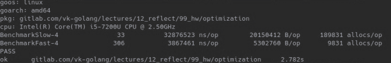

# Домашнее задание №10

Начальный прогон бенчмарков.

  

1. Оптимизация вызова функции regexp.MatchString
  - При отображении функций отсортированных по потреблению cpu видно, что функции для работы с регулярными выражениями занимают больше всего процессорного времени (MatchString и Compile).

  

  - Также при исследовании функции FastSearch построчно видно, что на строчках 60 и 82, где непосредственно вызывается MatchString, потрачено много времени.    

  

  - Главная причина такого потребления заключается в том, что функция regexp.MatchString вызывается в цикле большое количество раз, и под капотом включает в себя компилирование регулярного выражения с заданным паттерном. Компилирование регулярки очень затратная операция, да и сам матчинг тоже не быстрый. Данный момент можно было бы оптимизировать путем прекомпилирования данных регулярок, т.е. сделать их глобальными переменными. Однако данные регулярные выражения очень просты, и целесообразнее будет вместо них применить strings.Contains. Кроме того, regexp.MatchString потенциально может быть источником ошибки.

  - После первой же оптимизации виден прирост в производительности.

  

2. Оптимизация функции json.Unmarshal
  - Проделав операции, аналогичные тем, что были в первом пункте, видим, что теперь наиболее затратная операция - json.Unmarshal.
  
  

  - Видно, что json.Unmarshal вызывается на строчке 36, и затрачивает огромное количество ресурсов

  

  - Причина большого потребления ресурсов данной функции в том, что она внутри использует рефлексию. Поэтому применим кодогенератор easyjson, который нам сгенерирует высокопроизводительный и явный код для десериализации юзеров в структуру. Прирост производительности также заметен.
  
  

3. Оптимизация исключением лишних утверждений типов (type assertions) и заменой способа хранения юзеров с мапы(map[string]interface{}) на структуру юзера.
  - Данный пункт является следствием предыдущего, поскольку применив кодогенерацию, потребность в данных вещах отпала, и это также благоприятно сказывается на потреблении cpu и памяти.

4. Оптимизация вызова функции ReplaceAllString
  - Данная оптимизация проводится аналогичным образом, как в первом пункте. Причины все те же, regexp можно заменить обычной функцией из пакета strings.

  

  - После оптимизации видим небольшие улучшения

  

5. Оптимизация вызова outil.ReadAll(file)
  - При исследовании профиля памяти сразу бросается в глаза чрезмерное потребление памяти функцией outil.ReadAll(file). Проблема заключается в том, что нет нужды считывать весь файл в память, поскольку работа идет лишь с одной строкой(пользователем). При увеличении размера входных данных данная проблема усугубится еще сильнее.

  
  
  - Исправляем данный момент путем чтения за раз одной строки и последующей ее обработки. В дополнении, данная оптимизация убирает нужду в функции strings.Split, а также преобразование байтов к строке внутри нее, которые нагружали cpu и особенно память. Также устраняется преобразование строки в слайс байтов при вызове Unmarshal и перевыделение памяти слайса users при добавлении в него юзеров, поскольку слайс при создании не был преаллоцирован на нужный размер.
  - После данной оптимизации видим серьезное улучшение всех показателей.

  

6. Оптимизация конкатенации строк
  - Опять исследуем профиль памяти и видим, что на строчках 91 и 94 очень большое потребление памяти. Все дело в конкатенации строк. Данная операция очень ресурсоемкая поскольку каждый раз при склеивании строк происходит выделение памяти для новой строки и затем копирование данных соединяемых строк. С увеличением строки это бьет все больнее и больнее. Кроме того излишне нагружаем GC.

  

  - Для оптимизации этого момента применим strings.Builder. А вместо конкатенации в функции fmt.Fprintln используем fmt.Fprintf и распечатаем строку через %s
  - Видим улучшения по памяти
  
  

7. Оптимизация аллокации структуры юзера
  - Поскольку в один момент мы обрабатываем одну строку/юзера, то нет смысла выдялять память под юзера на каждой итерации цикла. Достаточно создать переменную вне цикла и занулять значение в конце цикла.
 
  
  
  Результат оптимизации заметен

  

8. Оптимизация поиска встречавшихся ранее браузеров и их добавление; удаление двойного итерирования по слайсу с браузерами
  - При исследовании профиля cpu видны затраты при итерировании по слайсу со встретившимися ранее браузерами. Также данный слайс хранит уникальные значения, и для чтобы проверить встречался ли ранее браузер необходимо каждый раз итерироваться по всему слайсу. Это линейная зависимость, а можно сделать константую, использовав мапу для этих целей. Также заранее преалоцируем некоторое количество памяти. Также несколько зарефакторим данные участки кода и удалим ненужные переменные uniqueBrowsers и notSeenBefore. Заодно уберем двойное прохождение по слайсу browsers.
  
  

  - В результате немного улучшилась производительность
  
  

### Сравнение с BenchmarkSolution
|                     |     |               |             |
|---------------------|-----|---------------|-------------|
| BenchmarkSolution-8 | 500 | 2782432 ns/op | 559910 B/op | 10422 allocs/op   
| BenchmarkFast-4     | 658 | 1728695 ns/op | 496272 B/op | 6478 allocs/op
